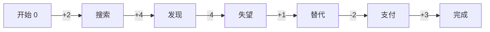

# 用户旅程地图设计框架

## 7大核心要素详解

### 1. 用户目标（Goal）

**定义**：用户试图达成的核心任务或期望结果。

**收集方法**：
- 用户访谈："你为什么使用这个产品？"
- 数据分析：用户最常完成的任务路径
- 场景观察：用户实际使用中的目标导向

**撰写要点**：
- 使用用户语言，不是产品语言
- ❌ "使用我们的搜索功能"
- ✅ "快速找到我需要的信息"

**示例**：
```
B2C电商：在预算内买到合适的生日礼物
SaaS产品：快速完成月度数据报告
在线教育：掌握Python基础编程能力
```

---

### 2. 具体行为（Actions）

**定义**：用户为达成目标而执行的一系列具体操作步骤。

**分阶段方法**（推荐使用5阶段模型）：
1. **认知阶段**（Awareness）：用户发现需求
2. **考虑阶段**（Consideration）：评估方案
3. **决策阶段**（Decision）：做出选择
4. **使用阶段**（Usage）：实际体验
5. **分享阶段**（Advocacy）：推荐传播

**行为粒度**：
- 太粗："使用产品" ❌
- 太细："点击第3个按钮" ❌
- 合适："浏览商品列表，对比价格和评价" ✅

**示例**：
```
电商购物旅程
├─ 认知：收到朋友推荐/看到广告
├─ 考虑：打开APP浏览首页 → 搜索关键词 → 查看多个商品
├─ 决策：查看详情页 → 阅读评价 → 对比价格 → 加入购物车
├─ 使用：填写收货信息 → 选择支付方式 → 完成支付
└─ 分享：收货后评价 → 分享给朋友
```

---

### 3. 触点（Touchpoints）

**定义**：用户与产品/服务交互的所有接触点。

**触点分类**：

| 类型 | 说明 | 示例 |
|------|------|------|
| 数字触点 | 线上渠道 | APP、网站、小程序、H5、公众号 |
| 物理触点 | 线下渠道 | 门店、产品包装、宣传物料 |
| 人际触点 | 人与人交互 | 客服、销售、社群 |
| 第三方触点 | 外部平台 | 社交媒体、支付平台、物流 |

**标注要素**：
- 触点名称：商品详情页
- 渠道类型：移动端APP
- 交互方式：浏览、滑动、点击
- 关键功能：查看图片、规格参数、用户评价

**示例**：
```
阶段：考虑阶段
├─ 触点1：微信广告 → 吸引点击
├─ 触点2：H5落地页 → 展示卖点
├─ 触点3：APP首页 → 个性化推荐
└─ 触点4：搜索结果页 → 筛选对比
```

---

### 4. 情绪曲线（Emotions）

**定义**：用户在旅程各阶段的情绪起伏和满意度变化。

**评分标准**（-5到+5）：
```
+5：非常愉悦，超出预期
+3：满意，符合预期
 0：中性，无明显感受
-3：失望，体验不佳
-5：愤怒，极度糟糕
```

**标注方法**：
- 每个关键行为标注情绪值
- 标出峰值时刻（Peak Moment）
- 标出谷值时刻（Pain Moment）
- 记录情绪触发原因

**情绪曲线规律**：
- 健康产品：整体正向，有小波动
- 问题产品：大幅波动，多次跌入负值
- 峰终定律：记住最高峰和结束时的感受

**示例**：
```
搜索商品 (+2) → 看到心仪商品 (+4) → 发现无货 (-4) 
→ 找到替代品 (+1) → 支付流程繁琐 (-2) → 成功下单 (+3)
```

**可视化技巧**：


---

### 5. 痛点（Pain Points）

**定义**：阻碍用户达成目标的问题、障碍和挫折点。

**痛点分类**：

| 类型 | 说明 | 示例 |
|------|------|------|
| 功能痛点 | 功能缺失/不好用 | 搜索不准确、无收藏功能 |
| 流程痛点 | 路径复杂/步骤繁琐 | 注册需要10步、支付流程长 |
| 性能痛点 | 速度慢/卡顿 | 页面加载5秒、频繁崩溃 |
| 情感痛点 | 情绪负面/不信任 | 担心隐私、害怕被骗 |

**优先级评估**（使用影响力矩阵）：

```
高频 × 高影响 = P0（必须解决）
高频 × 低影响 = P1（优先优化）
低频 × 高影响 = P1（监控改进）
低频 × 低影响 = P2（暂不处理）
```

**描述模板**：
```
[痛点名称] 
- 现象：用户在XX阶段遇到XX问题
- 影响：导致XX%流失 / 用户情绪-3分
- 原因：根本原因是XX
- 频次：每天XX人遇到
- 优先级：P0/P1/P2
```

**示例**：
```
【搜索结果不相关】
- 现象：用户搜索"男士T恤"，前10条结果包含女装和童装
- 影响：68%用户放弃搜索，情绪从+2跌至-3
- 原因：搜索算法未区分性别属性
- 频次：每日约2000次搜索受影响
- 优先级：P0
```

---

### 6. 机会点（Opportunities）

**定义**：针对痛点提出的改进方向和创新可能。

**机会点来源**：
1. 痛点反转：把问题变成解决方案
2. 峰值放大：让好的体验更好
3. 竞品启发：学习行业最佳实践
4. 技术驱动：新技术带来新可能

**机会点公式**：
```
机会点 = 用户期望 - 当前体验 + 技术可能性
```

**优先级矩阵**（价值 × 可行性）：

```
        高价值
          ↑
    快速赢 | 战略项目
  --------|--------
    填补类 | 可做可不做
          →
        高可行性
```

**描述模板**：
```
[机会点名称]
- 对应痛点：解决XX痛点
- 改进方向：通过XX方式提升XX
- 预期效果：预计提升XX指标XX%
- 实现成本：开发XX天 / 投入XX资源
- 优先级：快速赢/战略项目/填补类
- 参考案例：XX产品的XX功能
```

**示例**：
```
【智能搜索推荐】
- 对应痛点：搜索结果不相关（P0）
- 改进方向：引入AI算法，自动识别用户性别、偏好、场景
- 预期效果：搜索准确率提升40%，放弃率降低50%
- 实现成本：算法团队2周开发，1周测试
- 优先级：快速赢（高价值 + 中等成本）
- 参考案例：淘宝"猜你喜欢"、京东个性化搜索
```

---

### 7. 落地规划（Action Plan）

**定义**：将机会点转化为可执行的具体行动方案。

**SMART原则**：
- Specific（具体）：明确做什么
- Measurable（可衡量）：如何评估效果
- Achievable（可实现）：资源是否到位
- Relevant（相关）：与目标对齐
- Time-bound（有时限）：何时完成

**规划模板**：

```markdown
## 机会点：[名称]

### 目标
- 核心指标：XX率从XX%提升至XX%
- 次要指标：XX满意度提升XX分

### 方案设计
1. 需求阶段（Week 1-2）
   - 产品方案文档
   - 交互原型设计
   - 技术可行性评估

2. 开发阶段（Week 3-5）
   - 前端开发：XX功能
   - 后端开发：XX接口
   - 算法优化：XX模型

3. 测试阶段（Week 6）
   - 功能测试
   - A/B测试（10%流量）
   - 用户访谈（N=20）

4. 上线阶段（Week 7）
   - 灰度发布
   - 数据监控
   - 快速迭代

### 资源需求
- 人力：产品经理1人、设计师1人、前端2人、后端1人
- 时间：7周
- 预算：¥XX万

### 风险与应对
- 风险1：算法效果不达预期 → 准备备选方案（规则引擎）
- 风险2：开发延期 → MVP先行，分期上线

### 验收标准
- [ ] 搜索准确率 > 85%
- [ ] 页面加载时间 < 1秒
- [ ] 用户满意度 > 4.0分（5分制）
- [ ] 无P0级bug
```

**示例（简化版）**：
```
智能搜索推荐 → 2周开发 → 产品+算法+前端 → 预计提升转化率15%
  ├─ Week 1: 需求确认 + 原型设计
  ├─ Week 2: 算法训练 + 前端开发
  └─ Week 3: 测试上线 + 数据监控
```

---

## 工作流程建议

### 新增前置校验：证据分层

在分析任何旅程地图之前，先把输入信息按以下三类分层：

| 类型 | 定义 | 输出要求 |
|------|------|----------|
| 事实 | 已被证据支持的现状信息 | 必须注明证据来源 |
| 推测 | 基于有限信息的判断 | 必须注明依据 + 置信度 |
| 建议 | 面向优化的行动方案 | 必须对应痛点或机会点 |

**硬性原则**：所有旅程地图内容必须区分“事实 / 推测 / 建议”；其中事实必须注明证据来源，推测必须标注置信度，不能把假设写成事实。

### 收集顺序（推荐）

```
1. 用户目标 🎯（定方向）
   ↓
2. 具体行为 🚶（梳流程）
   ↓
3. 触点渠道 📱（找接触点）
   ↓
4. 情绪曲线 😊😔（标感受）
   ↓
5. 痛点挖掘 ⚠️（找问题）
   ↓
6. 机会点识别 💡（想方案）
   ↓
7. 落地规划 📋（做计划）
```

### 跨要素关联检查

确保逻辑一致性：
- ✅ 每个痛点 → 至少1个机会点
- ✅ 每个机会点 → 至少1个落地行动
- ✅ 情绪低谷 ↔️ 痛点位置一致
- ✅ 触点 ↔️ 行为步骤对应
- ✅ 事实类结论 ↔️ 有明确证据来源
- ✅ 推测类结论 ↔️ 有依据与置信度

### 可信度自检

在输出前逐条检查：
- 这条内容是真实已知，还是基于线索的判断？
- 如果是事实，证据来源是否具体到“访谈/埋点/页面/客服/问卷/录屏”？
- 如果是推测，是否明确写了“推测”而非伪装成事实？
- 这个触点、流程、角色是否在真实产品里存在？
- 这个建议是否直接对应某个痛点，而不是空泛表达？

---

## HTML 报告模板建议

### 默认汇报模板：Figma Board Journey Report
- 对应文件：`./templates/figma-board-journey-report.html`
- 适用于正式汇报版用户体验地图 / 用户旅程地图 / Experience Map
- 推荐在需要“汇报感、评审感、可分享感”时优先采用

### 模板骨架
1. Hero 标题区：项目标题、摘要、研究范围、时间
2. 统计卡片区：样本量、阶段/节点数、最低情绪点、核心机会
3. 画像与洞察区：统一用户画像 + 关键洞察
4. 证据可信度区：
   - 必须单独展示【事实 / 推测 / 建议】
   - 每条推测必须有【依据】与【置信度】
   - 每条事实必须有【证据来源】
5. 验证清单区：明确已验证项、待验证项、建议补充验证动作
6. 标准地图坐标系：
   - 二级表头（阶段 / 具体行为）
   - 7 条泳道（目标 / 行为 / 触点 / 情绪 / 痛点 / 机会点 / 落地规划）
   - 情绪曲线嵌入地图坐标系表格内部
   - 情绪曲线每个点位默认叠加对应表情，提升可读性与情绪感知
7. 问题清单：按阶段与优先级收敛
8. 完整问题全集：共性问题 + 各真实用户名下的原始问题

### 套用建议
- 用户提供真实姓名时，报告内统一使用真实姓名，不用“用户1/用户2”代称
- 正式汇报版必须把“这个事情是不是事实、是不是推测、靠不靠谱”显式写出来，而不是只在分析过程中内化
- 情绪曲线点位默认增加对应表情（如 😄 / 🙂 / 😕 / 😣），除非用户明确不要
- 如果阶段较多或行为节点较细，必须保留横向滚动
- 洞察、问题、机会点应尽量卡片化，避免长段落

## 常见问题

### Q1: 如何判断阶段划分是否合理？
**A**: 每个阶段应该：
- 有明确的起止标志
- 用户心智模式不同
- 一般3-7个阶段为宜

### Q2: 情绪曲线太平怎么办？
**A**: 可能是：
- 分析不够细致，需深入用户访谈
- 产品真的很平庸，缺少惊喜点
- 阶段划分太粗，细化后会看到波动

### Q3: 痛点太多如何聚焦？
**A**: 使用优先级矩阵：
1. 标记高频+高影响（P0）
2. 聚焦前3-5个痛点
3. 其他问题记录待排期

### Q4: 机会点和落地规划的区别？
**A**: 
- 机会点 = WHAT（做什么）
- 落地规划 = HOW（怎么做）
- 例：机会点"优化搜索" → 落地规划"引入ES搜索引擎，2周开发"

### Q5: 没有证据的内容怎么办？
**A**:
- 不要直接写成事实
- 先降级标注为“推测”
- 明确依据来源（如：少量访谈、页面观察、行业经验）
- 标注置信度（高/中/低）
- 如影响关键判断，补充验证计划

---

## 参考资源

- Nielsen Norman Group: User Journey Mapping 101
- Adaptive Path: Guide to Experience Mapping
- IDEO: Human-Centered Design Toolkit
